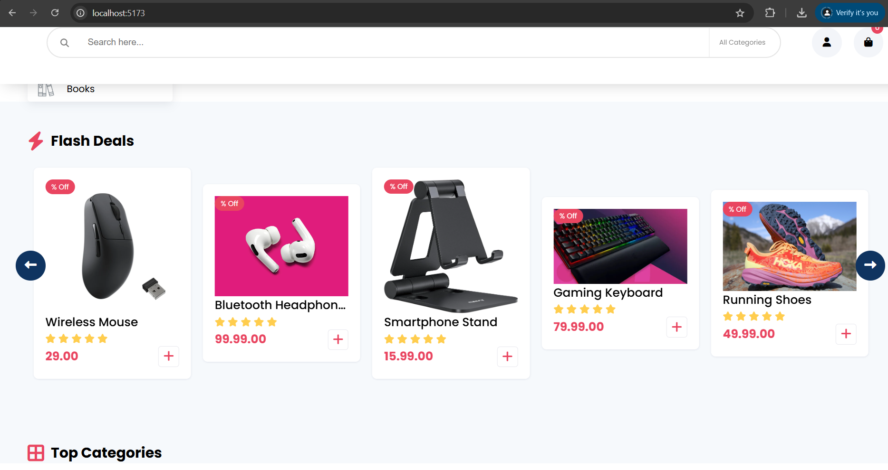

# E-Commerce Platform

Full-stack microservices e-commerce application with React frontend and Node.js backend services.

## Postman Collection File

[Postman Collection File](backend/config/swagger-output.json)


## Screenshot


## Architecture

```
    A[Frontend] --> B[Backend API]
    B --> C[MongoDB]
    B --> D[Payment Service]
    B --> E[Invoice Service]
    D --> F[Kafka]
    F --> E
```

## **Middleware**

### **Protected Routes**

Some routes require authentication or specific roles. Use the following middleware to secure your routes:

- **`authenticateUser`**: Ensures the user is logged in.
- **`authorizeRoles('admin')`**: Restricts access to admin users.

---

## **Usage**


Set up environment variables in a .env file like this:
```
PORT=5000
MONGO_URI=mongodb://localhost:27017/e-commerce-db
JWT_SECRET=jwtsecretkeyhere201144
EMAIL_SERVICE=gmail
EMAIL_USERNAME=your_email@gmail.com
EMAIL_PASSWORD=your_email_password_or_app_password
EMAIL_FROM=your_email@gmail.com
```


```
ecommerce/
├── frontend/
├── backend/
├── microservices/
│   ├── payment-service/
│   └── invoice-service/
└── docker-compose.yml
```

Docker file:

```
version: '3'
services:
  frontend:
    build: ./frontend
    ports:
      - "5173:5173"
    
  backend:
    build: ./backend
    ports:
      - "5000:5000"
      
  payment:
    build: ./microservices/payment-service
    ports:
      - "3001:3001"
      
  invoice:
    build: ./microservices/invoice-service
    ports:
      - "3002:3002"
      
  kafka:
    image: wurstmeister/kafka
    ports:
      - "9092:9092"
    environment:
      KAFKA_ADVERTISED_HOST_NAME: localhost
      
  zookeeper:
    image: wurstmeister/zookeeper
    ports:
      - "2181:2181"
      
  mongodb:
    image: mongo:6
    ports:
      - "27017:27017"
```

Windows kurulumu için gereken komutlar:

````
# Create project structure
mkdir ecommerce
cd ecommerce
mkdir frontend backend microservices
cd microservices
mkdir payment-service invoice-service
cd ..

# Install dependencies
cd frontend
npm install react vite @vitejs/plugin-react

cd ../backend
npm install express mongoose kafka-node

cd ../microservices/payment-service
npm install express kafkajs mongoose

cd ../invoice-service
npm install express kafkajs mongoose
```

Docker sistemi ayağa kaldırma
```
# Start all services
docker-compose up -d

# Start development servers
cd frontend
npm run dev

cd ../backend
npm run dev

cd ../microservices/payment-service
npm run dev

cd ../invoice-service
npm run dev
```